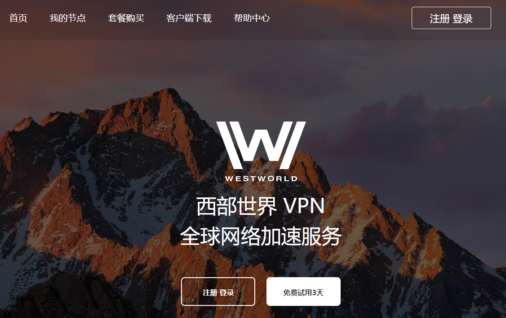
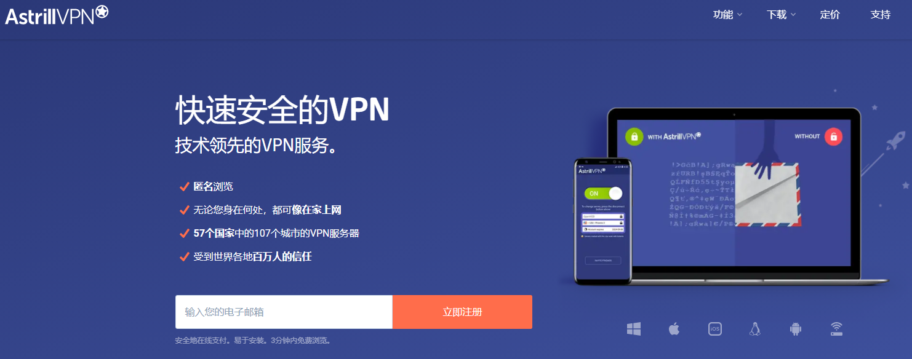

# 三个小众但特别好用的翻墙梯子软件，手机电脑都能用

稳定vpn,买vpn 梯子工具,可用的vpn,vpn梯子,稳定的梯子,免费好用的梯子,购买vpn,稳定的vpn,推荐vpn,网络梯子,付费vpn推荐,梯子推荐,靠谱的vpn,好用的梯子,便宜的vpn,能用的梯子,可以用的vpn,能用的vpn,求vpn,好用的梯子,靠谱vpn,还能用的vpn,可以使用的vpn,vpn怎么买,pc端的好梯子,便宜好用的加速器,便宜vpn,最便宜的vpn,vpn付费,电脑梯子软件,免费梯子pc 

### 介绍三个小众但是特别好用的[翻墙梯子软件](https://github.com/yourkind/tiziVPN)，都是这几年自己用过的，并且支持手机和电脑同时使用并且多设备可以同时在线，虽然小众，但是运营时间足够长，毕竟短期内出现的梯子没有经过市场的充分检验咱也不敢用，万一哪天就跑路了。而且我个人选梯子比较注重便宜以及性价比，免费的梯子不敢用，付费的太贵也用不起，所以价格不贵，但是在同等价位当中[速度比较快的梯子](https://www.taoxinbi.com/article/5846.html)软件就是我推荐的首选对象。

## 一、西部世界（Westworld）梯子

这款梯子软件来自欧洲，是我个人用的比较久的一款，不管是pc端还是手机端都有在使用，他们的客户端遍及ios-windows-mac-Linux-安卓等系统，基本覆盖了日常生活中所能用到的全部设备。

西部世界的线路众多，尤其是香港专线和日本专线在速度方面表现的十分有益，基本能将本地网速拉满，同时他们的所有线路都是IEPL专线，可以避免高峰时期的网络拥堵，确保全天24小时的网络高速与稳定。

对于新用户特别友好的一点是，西部世界这个机场梯子支持新人的三天免费试用，在这个时间段当中大家可以充分体验到这个梯子的速度以及稳定性，确保大家在最终决定是否购买的环节不会出错。

这个梯子的价格定位也很友好，月费25，在所有梯子当中价格不算高，但是结合他们的服务，速度和稳定性而言，性价比可以说是很可以了。

同时他们的线路也能够解锁Netflix等奈飞流媒体，喜欢追剧的朋友特别合适，用来观看视频速度也很快，不会出现卡顿的现象。

### [点击访问西部世界官网](https://xbsj3462.fun/i/ems099)

## 二、Vypr梯子

这款梯子软件来自瑞士，也是我长久以来作为备用梯子的首选，毕竟梯子软件这种东西，有时候抽风连不上真的是很让人头疼的一件事情，已经给广大网民提供了很久的服务。

特点是在最近的一次更新中，对ios启用了变色龙协议，并且也支持多台设备同时登录使用，虽然客户端是全英文的，但是基本也都能够看懂，使用起来比较方便，不会有什么需要设置乱七八糟协议的地方。

节点类型很丰富，有香港、日本、美国等等，价格中规中矩，虽然比西部世界略贵，但是与其稳定的性能相比，性价比也还算比较可以。

### [点击访问Vypr官网](https://www.vyprpn.com/)

## 三、Astrill

Astril是所有翻墙软件当中比较低调的一位，最早几年比较流行，后期不知道因为什么原因，收缩了推广，但是目前依然还在提供着服务。

这个梯子我接触的比较久，所以也一直在我的备用梯子列表当中躺着，就上网速度和网络环境的稳定性而言，它并不比前面两款差，同样支持多设备登录，以及客户端覆盖了我们日常生活中可能用到的所有系统，在亚洲地区拥有很多的服务器，提供着稳定可靠的服务。

### [Astrill官网地址](https://www.astrill.com/)

